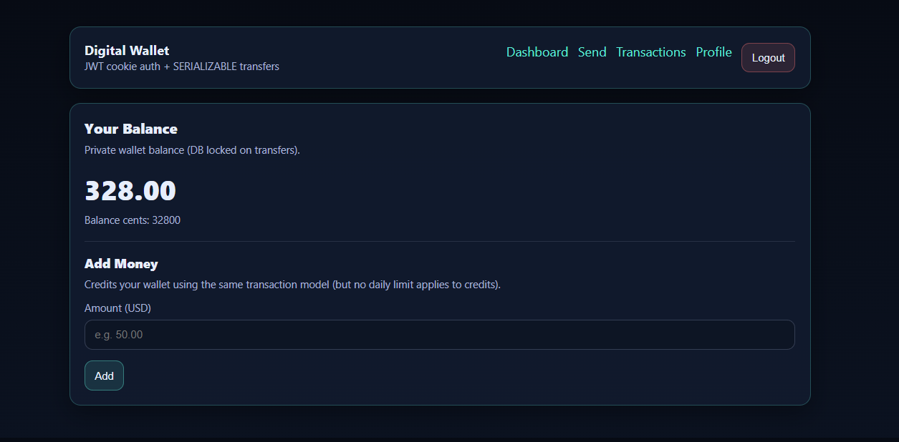
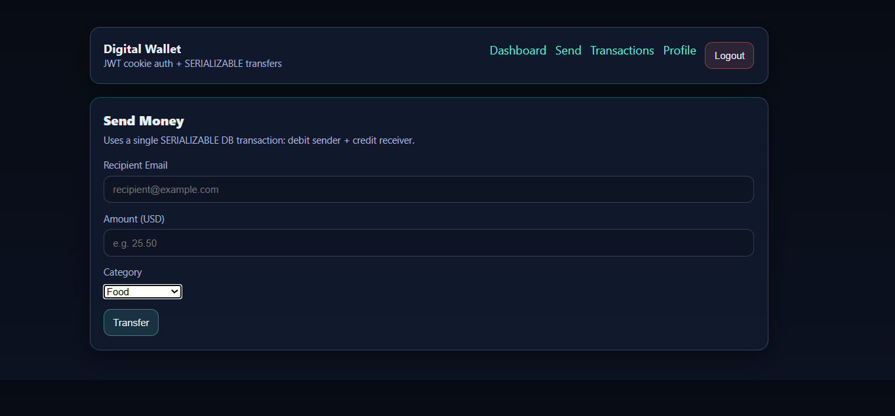
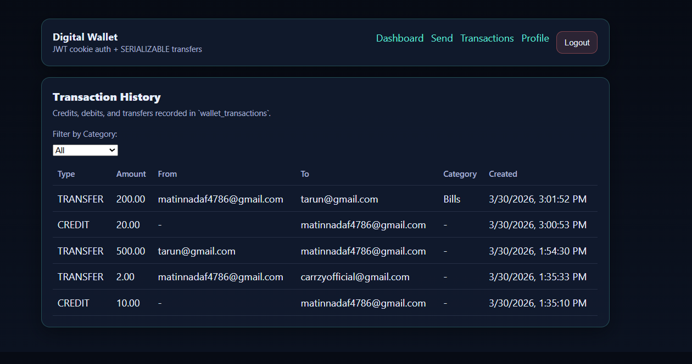
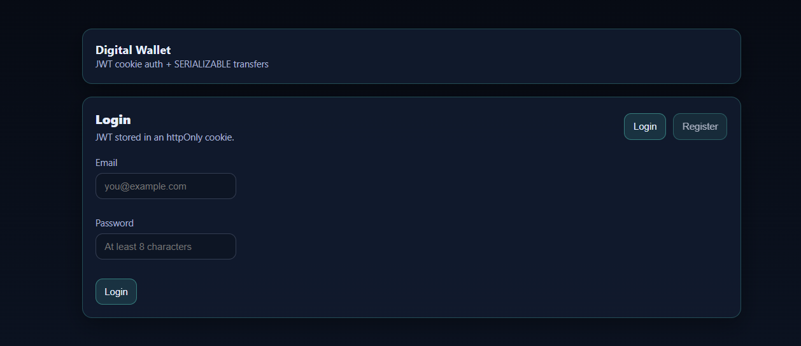
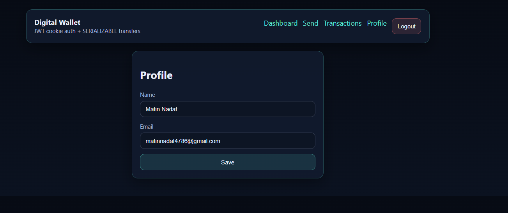

# 💳 Digital Wallet System

A full-stack **Digital Wallet Web Application** built with a focus on **OOP principles, ACID-compliant transactions, and scalable backend architecture**.

This system allows users to securely manage funds, perform transactions, and track financial activity with real-world guarantees like **SERIALIZABLE isolation**.

---

## 📌 Table of Contents

- [🚀 Features](#-features)
- [🧠 OOP Concepts](#-oop-concepts-used)
- [🧾 ACID Properties](#-acid-properties)
- [🛠️ Tech Stack](#️-tech-stack)
- [📁 Project Structure](#-project-structure)
- [📸 Screenshots](#-screenshots)
- [⚡ Getting Started](#-getting-started)
- [🔌 API Endpoints](#-api-endpoints)
- [👨‍💻 Author](#-author)

---

## 🚀 Features

### 🔐 Authentication & Security
- JWT-based authentication (stored in HTTP-only cookies)
- Protected routes using middleware
- Rate limiting to prevent abuse
- Secure session handling

---

### 👛 Wallet Management
- Create wallet for each user
- Real-time balance tracking
- Database-level locking during transactions

---

### 💸 Transactions System
- Credit money to wallet  
- Debit money from wallet  
- Transfer money between users  

✔ Uses **SERIALIZABLE DB transactions**  
✔ Ensures **atomic debit + credit operations**  

---

### 📜 Transaction History
- View all transactions (credit, debit, transfer)
- Filter by category
- Timestamped logs

---

### 👤 Profile Management
- View and update user details
- Persistent storage

---

## 🧠 OOP Concepts Used

- **Encapsulation** → Logic hidden inside services  
- **Inheritance** → Transaction classes extend base class  
- **Polymorphism** → Different transaction behaviors  
- **Abstraction** → Domain layer simplifies logic  

---

## 🧾 ACID Properties

- **Atomicity** → All operations succeed or fail together  
- **Consistency** → Data integrity maintained  
- **Isolation** → SERIALIZABLE prevents race conditions  
- **Durability** → Data persisted safely  

---

## 🛠️ Tech Stack

### Backend
- Node.js  
- Express.js  
- Sequelize ORM  
- MySQL / PostgreSQL  
- JWT + Cookies  

### Frontend
- React (Vite)  
- Context API  
- Axios  
- Minimal clean UI  

---

## 📁 Project Structure

Digital-Wallet/

│

├── backend/

│ ├── config/

│ ├── controllers/

│ ├── middleware/

│ ├── models/

│ │ ├── transactions/

│ │ ├── domain/

│ ├── routes/

│ ├── services/

│ ├── utils/

│ ├── schema.sql

│ └── server.js

│

├── frontend/

│ ├── src/

│ │ ├── api/

│ │ ├── context/

│ │ ├── pages/

│ │ ├── App.jsx

│ │ └── main.jsx

│

└── screenshots/

---

## 📸 Screenshots

### 🏠 Dashboard

---

### 💸 Send Money

---

### 📜 Transaction History

---

### 🔐 Login Page

---

### 👤 Profile Update

---

## ⚡ Getting Started

### 1️⃣ Clone the Repository
bash
git clone https://github.com/your-username/digital-wallet.git
cd digital-wallet

### 2️⃣ Backend Setup
cd backend
npm install

Create .env file:

PORT=4000

CLIENT_ORIGIN=http://localhost:5173

DB_HOST=localhost

DB_USER=root

DB_PASSWORD=yourpassword

DB_NAME=wallet_db

SEQUELIZE_SYNC=true

Run backend:
npm start

### 3️⃣ Frontend Setup

cd frontend

npm install

npm run dev

### 🔌 API Endpoints

Auth

POST /auth/register

POST /auth/login

POST /auth/logout

Wallet

GET /wallet

POST /wallet/create

Transactions

POST /transactions/credit

POST /transactions/debit

POST /transactions/transfer

GET /transactions/history

Profile

GET /profile

PUT /profile/update

### 🎯 Key Highlights 
Real-world financial system design

Uses SERIALIZABLE isolation (rare in projects)

Strong OOP implementation in backend

Clean architecture (Controller → Service → Domain → Model)

Demonstrates ACID compliance with SQL

## 👨‍💻 Author

Matin Nadaf |
Computer Science Engineer | Full Stack Developer

## 📄 License

This project is open-source under the MIT License.
